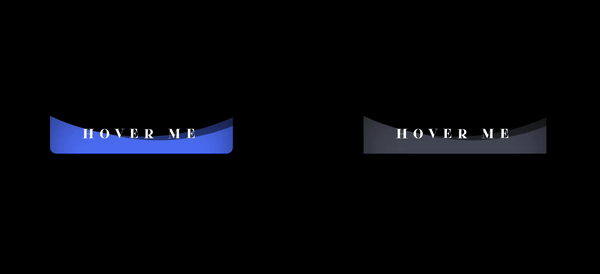
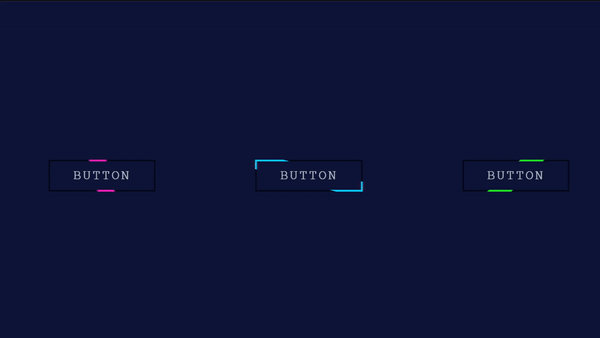

# **⚡Project Buttons Collection⚡**

### **Buttons Collection** - A collection of beautifully styled buttons using **HTML** and **CSS**.

#### Description:
This project is a simple and customizable collection of different button styles built using **HTML** and **CSS**. It includes a variety of button designs such as flat, gradient, 3D, outline, and hover animations to enhance any web interface. Whether you're a beginner or an experienced developer, this repository can be used to add stylish buttons to your web projects or learn how to create your own.

## *Waves hover buttons effect*

## *Button light ribbon & glowing effect*

